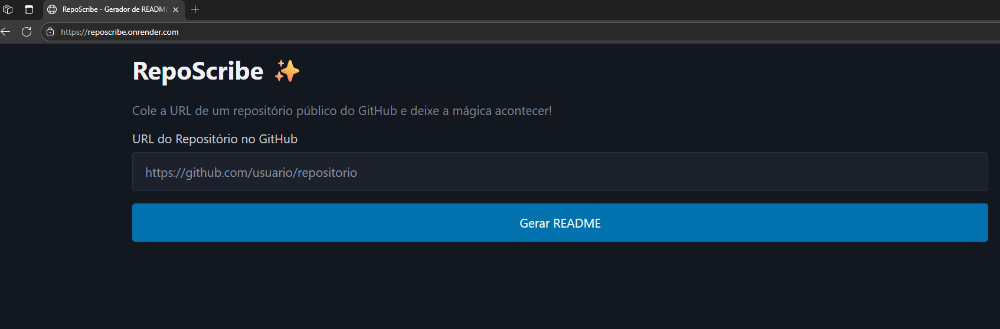
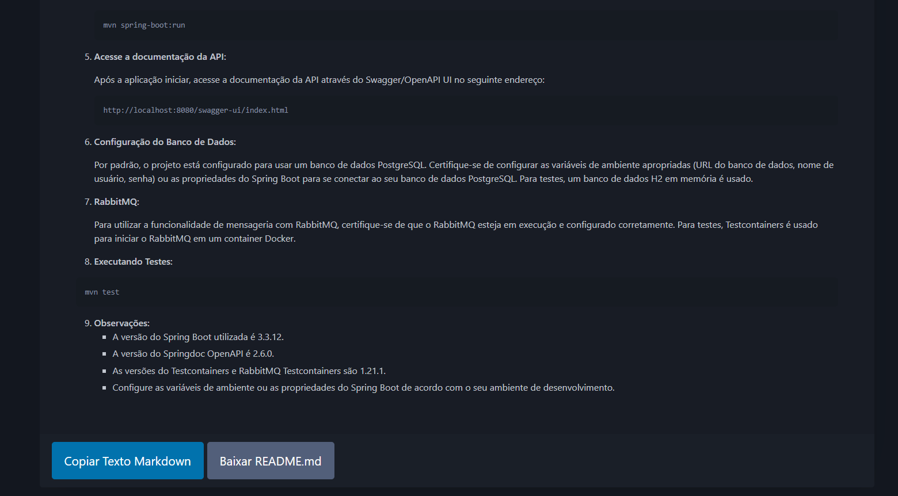

# RepoScribe ✨


[](https://reposcribe.onrender.com)

Um assistente de IA que gera arquivos `README.md` profissionais e bem estruturados a partir de repositórios públicos do GitHub.

---

## 🎯 Sobre o Projeto

Cansado de escrever documentação do zero? O **RepoScribe** é uma aplicação web (SaaS) que resolve esse problema. Basta fornecer a URL de um repositório público do GitHub, e o RepoScribe irá:

1.  Baixar e analisar a estrutura do código-fonte.
2.  Identificar as tecnologias e dependências utilizadas.
3.  Utilizar a IA do Google (Gemini) para gerar um `README.md` completo e informativo.
4.  Exibir o resultado com uma bela formatação, pronto para ser copiado ou baixado.

Este projeto foi criado para demonstrar a construção de uma aplicação full-stack em Python, integrando APIs de terceiros e desenvolvendo uma experiência de usuário útil e agradável.

---

### 📸 Screenshot da Aplicação

**A tela de entrada permite inserir o link do repositório do github para gerar o README.md**



**A tela de saída permite escolher entre copiar o conteúdo em markdown gerado, ou realizar o salvamento do arquivo README.md**




---

## 🛠️ Tecnologias Utilizadas

A aplicação foi construída com um conjunto de tecnologias modernas e eficientes:

**Backend:**
* **Python 3.10+**
* **Flask:** Micro-framework web para a criação do servidor e da API.
* **Requests:** Para realizar o download do repositório a partir do GitHub.
* **Google Generative AI:** Biblioteca para interagir com a API do Gemini 2.0 Flash.
* **Python-Dotenv:** Para gerenciamento de variáveis de ambiente.

**Frontend:**
* **HTML5 / CSS3 / JavaScript**
* **Marked.js:** Para renderizar o texto Markdown em HTML no lado do cliente.
* **Pico.css:** Framework CSS minimalista para um design limpo e responsivo.
* **github-markdown-css:** Folha de estilo para que o Markdown renderizado tenha a aparência do GitHub.

## 🚀 Como Rodar o Projeto Localmente

Para executar o RepoScribe na sua máquina local, siga estes passos:

**1. Clone o repositório:**
```bash
git clone [https://github.com/andersonaoliveira/repo-scribe.git](https://github.com/andersonaoliveira/repo-scribe.git)
cd repo-scribe
```

**2. Crie e ative um ambiente virtual:**
```bash
# Crie o ambiente
python -m venv venv

# Ative no Windows
venv\Scripts\activate

# Ative no Linux/macOS
source venv/bin/activate
```

**3. Instale as dependências:**
O arquivo `requirements.txt` contém todos os pacotes necessários.
```bash
pip install -r requirements.txt
```

**4. Configure as Variáveis de Ambiente:**
Este projeto precisa de uma chave de API do Google Gemini para funcionar.

* Crie um arquivo chamado `.env` na raiz do projeto (`repo-scribe/`).
* Dentro deste arquivo, adicione a seguinte linha, substituindo `SUA_CHAVE_AQUI` pela sua chave real:
    ```
    GEMINI_API_KEY=SUA_CHAVE_AQUI
    ```

**5. Execute a aplicação:**
```bash
python app.py
```
A aplicação estará disponível em `http://127.0.0.1:5000` no seu navegador.

## 🤝 Como Contribuir

Contribuições são o que tornam a comunidade open-source um lugar incrível para aprender, inspirar e criar. Qualquer contribuição que você fizer será **muito apreciada**.

1.  Faça um *Fork* do Projeto
2.  Crie sua *Feature Branch* (`git checkout -b feature/AmazingFeature`)
3.  Faça o *Commit* de suas mudanças (`git commit -m 'Add some AmazingFeature'`)
4.  Faça o *Push* para a Branch (`git push origin feature/AmazingFeature`)
5.  Abra um *Pull Request*

## 📄 Licença

Distribuído sob a Licença MIT. Veja o arquivo `LICENSE` para mais informações.

---

Criado por **andersonaoliveira**.
